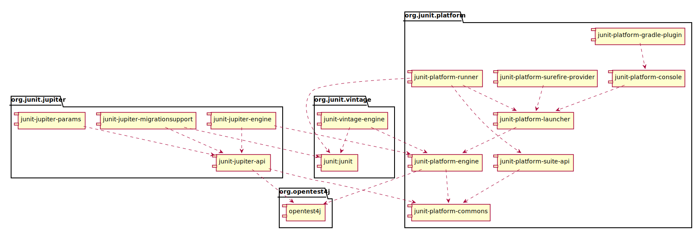

# JUnit 5

## JUnit概述

### What is JUnit 5?

与之前的版本不同,JUnit 5主要有三个不同子项目的几个不同模块组成。
JUnit 5 = JUnit Platform + JUnit Jupiter + JUnit Vintage

- JUnit Platform: 该项目是在JVM上提供启动测试框架的基础。还定义了用于开发在平台运行测试框架的TestEngine(测试引擎) API。此外还提供了一个控制台启动器，用于从命令行启动Platform，并为Gradle和maven的构建提供一个基于Junit4的runner插件。以便可以在JUnit Platform上运行任何测试引擎
- JUnit Jupiter： 是JUnit5 中新的编程模型和拓展模型的组合,Jupiter子项目提供了一个用于在JUnit Platform上运行基于Jupiter的测试的TestEngine。
- JUnit Vintage: 提供了一个用于在JUnit Platform上运行基于JUnit 3和基于JUnit 4的测试的测试引擎。

### 支持的Java版本

JUnit 5在运行时需要Java 8（或更高版本）。 但是，您仍然可以测试使用以前版本的JDK编译的代码。

## 安装

### 依赖

1. Junit Platform
    - Group Id:org.junit.platform
    - Version: 1.0.0
    - Artifact IDs:
        - junit-platform-commons: JUnit的内部公用库。 这些实用程序仅用于JUnit框架本身中的使用。不支持外部用户的任何用途。如果使用的话，你需要自己承受风险！
        - junit-platform-console： 支持从console发现和执行JUnit Platform上的测试。
        - junit-platform-console-standalone: 在Maven Central中，在junit-platform-console-standalone目录下提供了包含所有依赖性的可执行JAR。
        - junit-platform-engine： 测试引擎的Public api
        - junit-platform-gradle-plugin: junit platform对于gradle的支持
        - junit-platform-launcher：用于配置和启动测试计划的公共API - 通常由IDE和构建工具使用
        - junit-platform-runner：用于在junit 4环境的基础上，在junit platfomr执行测试和测试套件
        - junit-platform-suite-api: 在JUnit platform上配置测试套件的注解,由JUnitPlatform runner或者可能由第三方TestEngine实现支持。
        - junit-platform-surefire-provider：对于maven的支持

1. JUnit Jupiter
	- Group Id:org.junit.jupiter
	- Version: 5.0.0
	- Artifact IDs:
		- junit-jupiter-api:用于编写测试和扩展的JUnit Jupiter API。
		- junit-jupiter-engine: JUnit Jupiter测试引擎实现，只在运行时需要。
		- junit-jupiter-params: JUnit Jupiter支持参数化测试。
		- junit-jupiter-migrationsupport: 从JUnit 4到JUnit Jupiter的迁移支持，只需要运行所选的JUnit 4规则。

1. JUnit Vintage(复古)
	- Group Id: org.junit.vintage
	- Version: 4.12.0
	- Artifact ID: junit-vintage-engine: JUnit Vintage测试引擎实现，允许在新的JUnit平台上运行复制的JUnit测试，即以JUnit 3或JUnit 4样式编写的测试。

### 依赖图

### JUnit Jupiter 例子Project

- maven: 点击[这里](https://github.com/junit-team/junit5-samples/tree/r5.0.0/junit5-maven-consumer)下载
- Gradle: 点击[这里](https://github.com/junit-team/junit5-samples/tree/r5.0.0/junit5-gradle-consumer)下载
